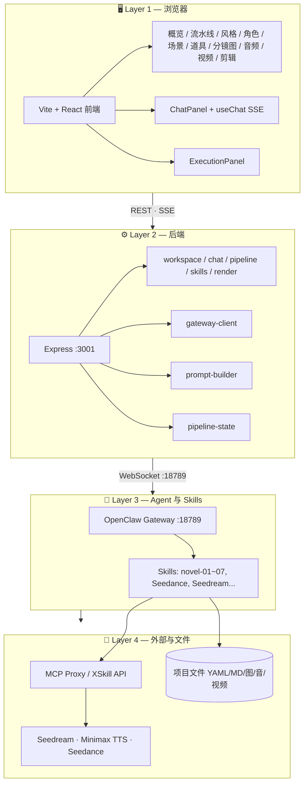
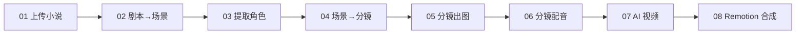

# OpenClaw Studio · 小说到视频创作流水线

基于 OpenClaw Gateway 与 Skills 的**小说/剧本 → 分镜 → 配图/配音 → AI 视频 → 合成**全链路创作平台。支持角色/场景/道具资产、分镜图、配音、Seedance 视频生成与 Remotion 合成。

---

## 架构概览



### 创作流水线（8 步）



| 步骤 | 说明 | 技能/工具 |
|------|------|-----------|
| 01 | 上传小说/剧本 | .txt 输入 |
| 02 | 剧本切分场景 | novel-02-script-to-scenes |
| 03 | 提取角色资产 | novel-01-character-extractor |
| 04 | 场景转分镜 | novel-03-scenes-to-storyboard |
| 05 | 分镜出图 | novel-04-shots-to-images (Seedream) |
| 06 | 分镜配音 | novel-05-shots-to-audio (Minimax) |
| 07 | AI 视频 | novel-06-shots-to-ai-video (Seedance) |
| 08 | 合成成片 | novel-07-remotion |

---

## 项目结构

```
├── openclaw-studio/     # 前端 (Vite+React) + 后端 (Express)
├── skills-openclaw/     # OpenClaw Skills (YAML + Markdown)
├── plugins/             # 插件示例
├── architecture.html    # 详细架构说明（含数据流、API、配置）
├── architecture-presentation.html  # 架构演示页
└── openclaw-extra.json5 # OpenClaw 扩展配置
```

- **前端**：左侧项目/技能、中间 Tab（概览/流水线/风格/角色/场景/道具/分镜图/音频/视频/剪辑）、右侧对话与执行面板。
- **后端**：REST API（workspace、chat、pipeline、skills、render）+ WebSocket 连接 OpenClaw Gateway。
- **Skills**：`skills-openclaw/` 下各技能对应流水线步骤；Gateway 通过 MCP/XSkill 调用画图、TTS、视频等能力。

---

## 快速开始

1. **环境**：Node 18+，Python 3.10+（部分 Skill 依赖）。
2. **配置**：复制 `.env.example` 为 `.env`，按需填写 OpenClaw Gateway 地址、模型等。
3. **启动 OpenClaw Gateway**：确保本机或可访问的 Gateway 已运行（默认 `:18789`）。
4. **启动本仓库**：
   ```bash
   cd openclaw-studio && npm install && npm run dev
   ```
5. 浏览器打开前端（如 `http://localhost:1420`），选择/创建工作空间与项目，即可从「流水线」或对话中执行各步骤。

---

## 架构图与文档

- **[architecture.html](./architecture.html)** — 完整架构说明（分层、API、流水线、数据流、配置）。
- **[architecture-presentation.html](./architecture-presentation.html)** — 单页架构演示（适合投屏/分享）。

---

## License

见仓库根目录或各子项目说明。
