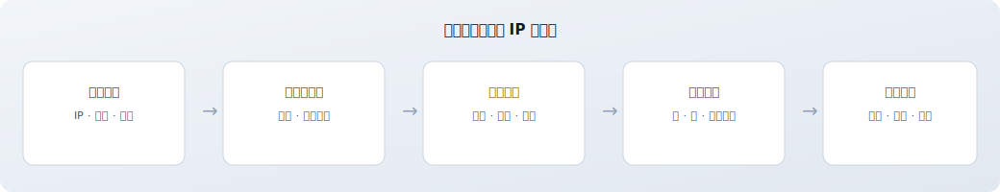
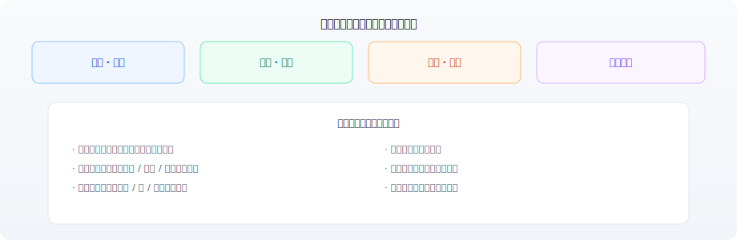
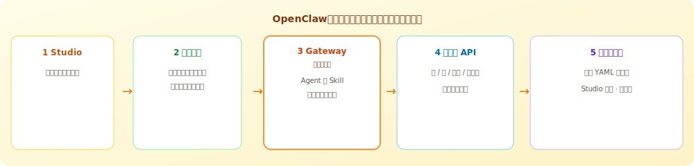
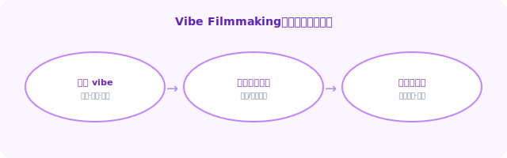
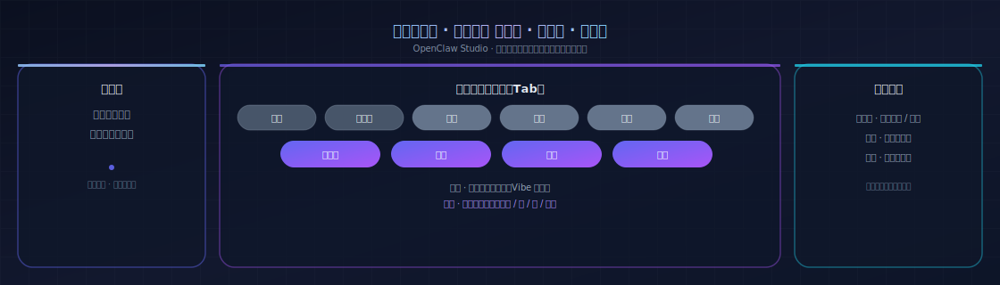
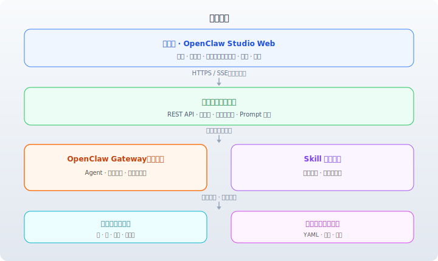
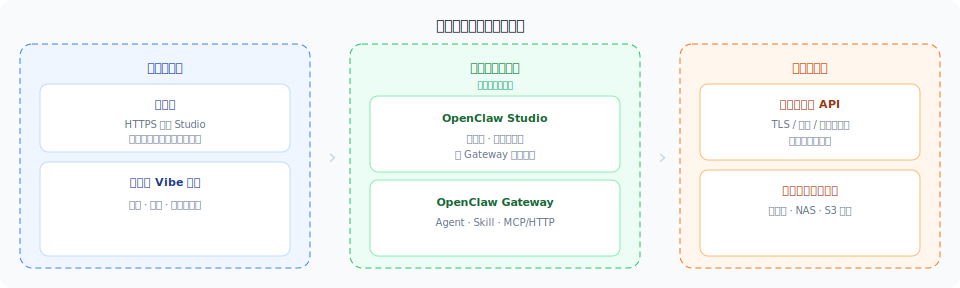

# 对客材料 · 索引与架构图库

本目录材料已 **成品化**：除可选替换贵司 Logo 外，**无需改稿**即可用于客户汇报。投屏建议 **Chrome / Edge 全屏（F11）**，分辨率 **1920×1080**。

---

## 推荐入口

| 场景 | 打开 |
|------|------|
| **一键进入全部投屏页** | **[presentation/index.html](./presentation/index.html)**（材料包门户） |
| **方案全文（可直接转发客户）** | [解决方案架构师-对客宣讲手册.md](./解决方案架构师-对客宣讲手册.md)（文内已引用 SVG；打包时请带上图文件夹） |
| **矢量架构图单独说明与预览** | **[solution-handbook-diagrams/README.md](./solution-handbook-diagrams/README.md)**（文件表 + 全图嵌入） |
| **决策者简版（非技术）** | [客户项目介绍-OpenClaw-Studio.md](./客户项目介绍-OpenClaw-Studio.md) |

---

## 架构图库（SVG 预览）

以下为 `solution-handbook-diagrams/` 内全部矢量图在本文中的**内嵌预览**，便于在 GitHub / 文档站一眼核对版式。更完整的说明（使用场景、与客户手册对应关系）见 **[solution-handbook-diagrams/README.md](./solution-handbook-diagrams/README.md)**。

### 业务与组织

*业务价值流：`business-value-stream.svg`*

*干系人与能力域：`business-roles-capabilities.svg`*

### 产品与叙事

*OpenClaw（龙虾）任务流：`openclaw-task-flow.svg`*

*Vibe Filmmaking 循环：`vibe-filmmaking-loop.svg`*

*产品工作台：`product-workbench.svg`*

### 技术与部署

*技术分层：`tech-four-layers.svg`*

*集成与信任域：`deployment-trust-zones.svg`*

---

## 推荐议程（约 30 分钟）

1. **业务架构** — [presentation/solution-business-architecture.html](./presentation/solution-business-architecture.html)  
2. **产品架构** — [presentation/solution-product-architecture.html](./presentation/solution-product-architecture.html)  
3. **技术架构（对客版）** — [presentation/solution-technical-architecture.html](./presentation/solution-technical-architecture.html)  
4. **集成与部署** — [presentation/solution-integration-deployment.html](./presentation/solution-integration-deployment.html)（三域等宽拓扑 + **OpenClaw/龙虾** 与 **Vibe Filmmaking** 叙事区）

---

## 投屏页与扩展阅读

| 材料 | 路径 |
|------|------|
| 业务架构 | [presentation/solution-business-architecture.html](./presentation/solution-business-architecture.html) |
| 产品架构 | [presentation/solution-product-architecture.html](./presentation/solution-product-architecture.html) |
| 技术架构（对客版） | [presentation/solution-technical-architecture.html](./presentation/solution-technical-architecture.html) |
| 集成与部署 | [presentation/solution-integration-deployment.html](./presentation/solution-integration-deployment.html) |
| 技术架构（动效详版，根目录） | [architecture-presentation.html](../architecture-presentation.html) |
| 研发向架构文档（根目录） | [architecture.html](../architecture.html) |
| 费用测算（**内部参考**，对外先脱敏） | [100分钟S级短剧费用测算.md](./100分钟S级短剧费用测算.md) |

**说明**：宣讲手册内 Mermaid 图可作为 Word / 飞书粘贴素材；**正式投屏以 HTML 为准**。静态 SVG 与手册插图同源，便于邮件附件与离线浏览。
