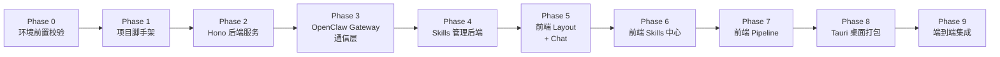
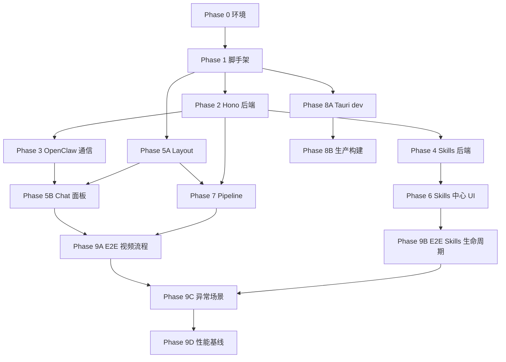

# OpenClaw Studio 阶段性测试与校验方案

> 对应架构计划: `openclaw_desktop_app_91539a9e.plan.md`
> 编写日期: 2026-02-28

---

## 测试分阶段总览



每个 Phase 完成后产出一份简短测试记录，格式参考 [skills-openclaw/TEST_REPORT.md](skills-openclaw/TEST_REPORT.md)。

---

## Phase 0: 环境前置校验

**目标**: 确认本机所有依赖工具就绪，避免后续阶段被环境问题阻塞。

| # | 校验项 | 命令 | 通过标准 |
|---|--------|------|---------|
| 0.1 | Node.js 版本 | `node -v` | >= 22.x |
| 0.2 | Rust 工具链 | `rustc --version && cargo --version` | 存在且可用 |
| 0.3 | Tauri CLI | `npx @tauri-apps/cli info` 或 `cargo install tauri-cli` | 可运行 |
| 0.4 | OpenClaw 安装 | `openclaw --version` | 已安装 |
| 0.5 | OpenClaw Gateway 启动 | `openclaw gateway --port 18789` + `curl http://127.0.0.1:18789/health` | 返回健康状态 |
| 0.6 | Skills 已加载 | `openclaw skills list` 或 Gateway 日志 | 至少 12 个自定义 Skills |
| 0.7 | LLM Provider 连通 | `openclaw` 对话测试: "你好" | 返回中文响应 |
| 0.8 | xskill API 连通 | `python3 xskill_api.py account` | 返回余额信息 |
| 0.9 | ClawHub CLI | `clawhub --version` | 已安装 (Skills 市场功能需要) |
| 0.10 | Git | `git --version` | 已安装 (GitHub 导入需要) |

**阻塞规则**: 0.1-0.4 全部不通过则停止; 0.5-0.8 不通过可标记跳过对应功能; 0.9-0.10 不通过仅影响 Skills 市场/导入功能。

---

## Phase 1: 项目脚手架

**目标**: 项目初始化、依赖安装、空壳编译通过。
**对应 TODO**: `setup-project`

| # | 测试项 | 方式 | 通过标准 |
|---|--------|------|---------|
| 1.1 | 前端初始化 | `npm create vite@latest` + 依赖安装 | `npm install` 无报错 |
| 1.2 | 前端编译 | `npm run build` | 成功生成 `dist/` 目录 |
| 1.3 | 前端 dev server | `npm run dev` | Vite 启动, 浏览器访问 `localhost:1420` 看到空白 React 页面 |
| 1.4 | Tailwind 生效 | 加一个 `<div className="text-red-500">Test</div>` | 浏览器中文字显示红色 |
| 1.5 | 后端初始化 | `cd backend && npm install` | 无报错 |
| 1.6 | 后端编译 | `cd backend && npm run build` | TypeScript 编译成功, `dist/` 生成 |
| 1.7 | TypeScript 类型检查 | `npx tsc --noEmit` (前后端) | 0 errors |

**验收**: 前后端均可独立启动, 无编译错误。

---

## Phase 2: Hono 后端服务

**目标**: 中间层 HTTP 服务 + SQLite 数据库 + CRUD API 全部可用。
**对应 TODO**: `hono-backend`

### 2A: 服务启动

| # | 测试项 | 方式 | 通过标准 |
|---|--------|------|---------|
| 2.1 | Hono server 启动 | `cd backend && npm run dev` | 日志显示 `Listening on :3001` |
| 2.2 | SQLite 初始化 | 启动后检查 | `data/` 下生成 `.db` 文件, 无迁移错误 |
| 2.3 | 健康检查 | `curl http://localhost:3001/api/health` | 返回 `{"ok": true}` |

### 2B: Projects CRUD

```bash
# 创建项目
curl -X POST http://localhost:3001/api/projects \
  -H 'Content-Type: application/json' \
  -d '{"title": "测试项目", "description": "Phase 2 测试"}'
# 预期: 返回 {id, title, ...}

# 列出项目
curl http://localhost:3001/api/projects
# 预期: 数组, 含刚创建的项目

# 获取单个
curl http://localhost:3001/api/projects/{id}
# 预期: 返回完整项目数据

# 更新
curl -X PUT http://localhost:3001/api/projects/{id} \
  -H 'Content-Type: application/json' \
  -d '{"title": "更新后的标题"}'
# 预期: 返回更新后的数据

# 删除
curl -X DELETE http://localhost:3001/api/projects/{id}
# 预期: 204 或 {ok: true}

# 再次列出
curl http://localhost:3001/api/projects
# 预期: 空数组
```

### 2C: Characters / Scenes / Shots / Tasks CRUD

每个资源类型重复上述 CRUD 流程, 至少验证:
- 创建单条 + 批量创建 (POST /batch)
- 列出 (GET, 带 projectId 过滤)
- 更新单条
- 外键约束: 删除 project 后, 关联的 characters/scenes/shots 应级联删除或返回错误

| # | 测试项 | 通过标准 |
|---|--------|---------|
| 2.4 | Characters CRUD | 增删改查正常, batch 创建 >=5 条 |
| 2.5 | Scenes CRUD | 增删改查正常, 按 projectId 过滤 |
| 2.6 | Shots CRUD | 增删改查正常, 按 sceneId 过滤, image/audio/video URL 可单独更新 |
| 2.7 | Tasks CRUD | 创建任务, 状态过滤 (pending/completed/failed) |
| 2.8 | 外键级联 | 删除 project 后, 子表数据清理 |

**验收**: 所有 curl 命令返回预期结果, 数据库数据一致。

---

## Phase 3: OpenClaw Gateway 通信层

**目标**: Express 中间层能与 OpenClaw Gateway 双向通信, 发送消息并接收流式响应。
**对应 TODO**: `openclaw-plugin`, `openclaw-client`

### 3A: Desktop Channel Plugin

| # | 测试项 | 方式 | 通过标准 |
|---|--------|------|---------|
| 3.1 | Plugin 部署 | 将 `plugins/desktop-channel/` 复制到 `~/.openclaw/extensions/`, 重启 Gateway | Gateway 日志显示 plugin 已加载 |
| 3.2 | Plugin 列表 | `openclaw plugins list` | 列表中包含 `desktop-channel` |
| 3.3 | RPC 方法注册 | `openclaw gateway call desktop.chat --params '{"message":"你好"}'` | 返回 Agent 响应文本 |

### 3B: Gateway RPC 客户端 (openclaw-client.ts)

| # | 测试项 | 方式 | 通过标准 |
|---|--------|------|---------|
| 3.4 | 同步调用 | 后端代码调用 `openclawClient.chat("你好")` | 返回响应文本, 无超时 |
| 3.5 | 流式调用 | 后端代码调用 `openclawClient.chatStream("你好")` | 逐块返回文本 chunks |
| 3.6 | 错误处理 | 关闭 Gateway 后调用 | 返回明确错误 (connection refused), 不崩溃 |
| 3.7 | 超时处理 | 设置 5s 超时, 发送耗时请求 | 超时后返回错误, 不挂起 |

### 3C: Chat API 端到端 (HTTP 层)

```bash
# 基本对话
curl -X POST http://localhost:3001/api/chat \
  -H 'Content-Type: application/json' \
  -d '{"message": "你好，请自我介绍"}'
# 预期: SSE 流式响应, Content-Type: text/event-stream

# 带项目上下文的对话
curl -X POST http://localhost:3001/api/chat \
  -H 'Content-Type: application/json' \
  -d '{"message": "当前项目有哪些角色？", "projectId": "{id}"}'
# 预期: Agent 能获取到项目数据并回答

# Skill 触发
curl -X POST http://localhost:3001/api/chat \
  -H 'Content-Type: application/json' \
  -d '{"message": "用 seedream 画一只猫"}'
# 预期: Agent 触发 seedream-image skill, 返回图片 URL
```

| # | 测试项 | 通过标准 |
|---|--------|---------|
| 3.8 | SSE 流式响应 | `curl` 可以逐行接收 `data:` 事件 |
| 3.9 | 上下文传递 | Agent 能读取 projectId 对应的数据 |
| 3.10 | Skill 触发 | Agent 自动匹配 skill 并执行工具调用 |
| 3.11 | 并发安全 | 同时发送 3 个 chat 请求, 各自独立返回 |

**阻塞规则**: 3.1-3.3 是全部后续 AI 功能的基础。如果 Plugin RPC 方案不可行, 需要 fallback 到 CLI 调用方式 (`child_process.spawn('openclaw', [...])`), 并在此处记录替代方案。

**验收**: `POST /api/chat` 返回 SSE 流, Agent 能理解上下文并触发 Skill 执行工具。

---

## Phase 4: Skills 管理后端

**目标**: Skills Manager 服务和 Skills API 全部可用。
**对应 TODO**: `skills-backend`

### 4A: 本地 Skills 文件系统操作

| # | 测试项 | 方式 | 通过标准 |
|---|--------|------|---------|
| 4.1 | 扫描 Skills | `GET /api/skills` | 返回数组, 含 workspace + managed 来源, 每项有 name/description/source/enabled/path |
| 4.2 | 优先级正确 | 在 workspace 和 managed 中放同名 Skill | 只返回 workspace 的版本 |
| 4.3 | Skill 详情 | `GET /api/skills/seedream-image` | 返回完整 SKILL.md 内容 (content 字段) |
| 4.4 | YAML frontmatter 解析 | 对每个 Skill | name, description, metadata 正确提取 |
| 4.5 | 创建 Skill | `POST /api/skills {name, content}` | `~/.openclaw/workspace/skills/{name}/SKILL.md` 被创建 |
| 4.6 | 更新 SKILL.md | `PUT /api/skills/{name} {content}` | 文件内容被覆盖, 再次 GET 返回新内容 |
| 4.7 | 删除 Skill | `DELETE /api/skills/{name}` | 目录被移除 (或移到回收站) |
| 4.8 | 不可删除 bundled | `DELETE /api/skills/{bundled-skill}` | 返回 403, 文件不受影响 |

### 4B: openclaw.json 配置读写

```bash
# 读取当前配置
GET /api/skills/seedream-image
# 预期: enabled: true/false, config: {env: {...}}

# 启用/禁用
PATCH /api/skills/seedream-image/config
  {"enabled": false}
# 预期: openclaw.json 中 skills.entries.seedream-image.enabled = false

# 配置 API Key
PATCH /api/skills/seedream-image/config
  {"env": {"SEEDREAM_API_KEY": "test-key"}}
# 预期: openclaw.json 中对应字段被写入

# 验证: 直接读取 ~/.openclaw/openclaw.json 确认数据一致
```

| # | 测试项 | 通过标准 |
|---|--------|---------|
| 4.9 | 配置写入 | `PATCH /config` 后, `openclaw.json` 文件内容正确 |
| 4.10 | 配置读取 | `GET /api/skills/{name}` 返回的 enabled/config 与文件一致 |
| 4.11 | 不破坏其他配置 | 修改一个 skill 的配置后, `openclaw.json` 中其他字段不变 |

### 4C: ClawHub 集成

| # | 测试项 | 方式 | 通过标准 |
|---|--------|------|---------|
| 4.12 | 市场搜索 | `GET /api/skills/marketplace/search?query=calendar` | 返回 ClawHub 搜索结果 |
| 4.13 | 安装 | `POST /api/skills/install {source:"clawhub", slug:"xxx"}` | Skill 被安装到本地, 列表中可见 |
| 4.14 | 发布 | `POST /api/skills/{name}/publish` | `clawhub publish` 执行成功 (需登录) |

### 4D: GitHub/URL 导入

| # | 测试项 | 方式 | 通过标准 |
|---|--------|------|---------|
| 4.15 | GitHub 导入 | `POST /api/skills/install {source:"github", url:"https://github.com/xxx/yyy"}` | 仓库被 clone, SKILL.md 验证通过, 复制到 skills 目录 |
| 4.16 | URL 导入 | `POST /api/skills/install {source:"url", url:"https://..."}` | 下载并安装 |
| 4.17 | 无效导入 | 导入无 SKILL.md 的仓库 | 返回错误, 不创建目录 |

### 4E: 热重载

| # | 测试项 | 通过标准 |
|---|--------|---------|
| 4.18 | 新增 Skill 后 Gateway 可见 | 通过 API 创建新 Skill 后, 下次 Agent 对话中可触发该 Skill |
| 4.19 | 删除 Skill 后 Gateway 不可见 | 删除后, Agent 不再识别该 Skill |

**验收**: 所有 CRUD + 配置 + 外部源操作通过, Skills 变更能被 Gateway 感知。

---

## Phase 5: 前端 — Layout + Chat

**目标**: 整体布局渲染正常, Chat 面板可发送/接收消息。
**对应 TODO**: `react-layout`, `react-chat`

### 5A: 布局渲染

| # | 测试项 | 验证方式 | 通过标准 |
|---|--------|---------|---------|
| 5.1 | AppLayout 渲染 | 浏览器访问 `localhost:1420` | 左右分栏布局, 无 JS 报错 |
| 5.2 | Sidebar 显示 | 观察左侧 | 项目列表 + Skills 中心入口 |
| 5.3 | TopBar 显示 | 观察顶部 | 步骤导航 + Gateway 状态指示灯 + 余额 |
| 5.4 | 路由切换 | 点击 Sidebar 各入口 | 右侧内容区切换, 无白屏 |
| 5.5 | 响应式 | 缩放窗口到 1024x680 (最小尺寸) | 布局不破裂 |

### 5B: Chat 面板

| # | 测试项 | 验证方式 | 通过标准 |
|---|--------|---------|---------|
| 5.6 | 输入框 | 键入文字 + 回车 | 消息出现在对话区 |
| 5.7 | 发送请求 | 开发者工具 Network | 发出 `POST /api/chat`, SSE 连接建立 |
| 5.8 | 流式渲染 | 发送 "你好" | 文字逐字/逐块出现, 非一次性渲染 |
| 5.9 | Markdown 渲染 | Agent 返回带代码/列表的回复 | 正确渲染 Markdown |
| 5.10 | 消息历史 | 连续发送 3 条消息 | 对话历史正确保留, 滚动流畅 |
| 5.11 | 加载状态 | 发送后等待响应期间 | 显示 loading 指示器, 输入框禁用 |
| 5.12 | 错误处理 | 关闭 Gateway 后发送 | 显示错误提示, 不白屏 |
| 5.13 | Skill 结果展示 | 发送 "用 seedream 画一只猫" | 图片 URL 正确渲染为图片 |

### 5C: Gateway 状态

| # | 测试项 | 通过标准 |
|---|--------|---------|
| 5.14 | 在线状态 | Gateway 运行时, TopBar 显示绿色指示灯 |
| 5.15 | 离线状态 | Gateway 停止时, TopBar 显示红色 + 断线提示 |
| 5.16 | 余额显示 | TopBar 显示 xskill 余额 (积分数) |

**验收**: 完整聊天流程可走通 (输入 → 发送 → 流式接收 → 展示), 布局无破裂。

---

## Phase 6: 前端 — Skills 中心

**目标**: Skills 增删改查全流程可在界面上完成。
**对应 TODO**: `skills-center-ui`, `skills-create-ui`

### 6A: Skills 列表

| # | 测试项 | 通过标准 |
|---|--------|---------|
| 6.1 | 列表加载 | 进入 Skills Center, 显示所有已安装 Skills 卡片 |
| 6.2 | 搜索过滤 | 输入 "novel", 只显示匹配的 Skills |
| 6.3 | 来源标签 | 每个 Skill 卡片显示来源 (workspace / managed / bundled) |
| 6.4 | 启用状态 | 已启用显示绿色开关, 已禁用显示灰色 |
| 6.5 | Tab 切换 | "已安装" / "市场" / "全部" 三个 Tab 数据正确 |

### 6B: Skill 详情 + 配置

| # | 测试项 | 通过标准 |
|---|--------|---------|
| 6.6 | 选中展示 | 点击 Skill 卡片, 右侧展示详情 (名称/描述/版本/路径) |
| 6.7 | 启用/禁用 | 切换开关 → 发送 PATCH 请求 → 刷新后状态保持 |
| 6.8 | 配置 API Key | 在配置面板输入 API Key, 保存 → openclaw.json 写入正确 |
| 6.9 | 配置环境变量 | 添加/删除环境变量, 保存 → 验证文件写入 |

### 6C: SKILL.md 编辑器

| # | 测试项 | 通过标准 |
|---|--------|---------|
| 6.10 | Monaco 加载 | 切到编辑器 Tab, Monaco Editor 渲染 SKILL.md 内容 |
| 6.11 | 语法高亮 | Markdown + YAML frontmatter 有正确高亮 |
| 6.12 | 编辑保存 | 修改内容 → 点保存 → `PUT /api/skills/{name}` → 文件写入 |
| 6.13 | 修改检测 | 内容有变化时, 保存按钮高亮; 无变化时置灰 |
| 6.14 | 大文件性能 | 加载 >500 行的 SKILL.md | 无明显卡顿 |

### 6D: 安装/卸载/发布

| # | 测试项 | 通过标准 |
|---|--------|---------|
| 6.15 | 从市场安装 | 搜索 → 点击安装 → loading → 本地列表中出现 |
| 6.16 | 从 GitHub 导入 | 输入 GitHub URL → 导入 → 本地列表中出现 |
| 6.17 | 卸载 Skill | 点击删除 → 确认弹窗 → 从列表消失, 文件移除 |
| 6.18 | 发布到 ClawHub | 点击发布 → 显示发布进度/结果 |

### 6E: 创建 Skill

| # | 测试项 | 通过标准 |
|---|--------|---------|
| 6.19 | 向导表单 | 填写 name/description/trigger/tools → 生成 SKILL.md 预览 |
| 6.20 | 向导保存 | 确认后, Skill 创建成功, 列表中可见 |
| 6.21 | AI 辅助创建 | 输入 "我需要一个调用 Flux 生成图片的 Skill" → Agent 生成 SKILL.md → 编辑器展示 |
| 6.22 | AI 结果编辑 | AI 生成的内容可在编辑器中修改后保存 |

**验收**: 完整的 Skills 生命周期 — 安装/创建 → 查看 → 配置/编辑 → 删除/发布 — 全部可在 UI 完成。

---

## Phase 7: 前端 — Pipeline

**目标**: 7 步流水线界面渲染正常, 数据正确加载, 操作触发 Agent 任务。
**对应 TODO**: `react-pipeline`

| # | 测试项 | 通过标准 |
|---|--------|---------|
| 7.1 | Step 导航 | TopBar 的 1-7 步按钮可点击切换 |
| 7.2 | Step1 剧本 | 文本编辑器渲染, 可输入/粘贴剧本 |
| 7.3 | Step2 场景 | 场景列表正确渲染 (从 API 加载) |
| 7.4 | Step3 分镜 | Shots 网格显示, 每个 shot 有编号/提示词/时长 |
| 7.5 | Step4 图片 | Shot 图片缩略图渲染, 无图时显示占位符 |
| 7.6 | Step5 音频 | 音频播放器渲染, 可点击播放 |
| 7.7 | Step6 视频 | 视频预览播放器 |
| 7.8 | Step7 导出 | 导出按钮, 参数配置面板 |
| 7.9 | Chat 触发流水线 | 在 Chat 中说 "提取角色" → Step1 更新角色数据 |
| 7.10 | 数据联动 | 切换项目后, 所有 Steps 数据刷新 |

**验收**: 项目切换 + 步骤切换 + 数据渲染全通过。

---

## Phase 8: Tauri 桌面打包

**目标**: 应用可作为原生桌面窗口运行, 自动启动后端和 Gateway。
**对应 TODO**: `tauri-shell`, `deploy-skills`

### 8A: 开发模式

| # | 测试项 | 方式 | 通过标准 |
|---|--------|------|---------|
| 8.1 | Tauri dev 启动 | `npm run tauri dev` | 桌面窗口打开, 加载前端页面 |
| 8.2 | 后端自动启动 | 观察日志 | Node.js backend 进程自动启动 |
| 8.3 | Gateway 自动启动 | 观察日志 | Gateway 在 :18789 启动 (或检测到已运行) |
| 8.4 | 窗口尺寸 | 目测 | 默认 1440x900, 最小 1024x680 |

### 8B: 生产构建

| # | 测试项 | 方式 | 通过标准 |
|---|--------|------|---------|
| 8.5 | 构建 | `npm run tauri build` | 生成 .app (macOS) |
| 8.6 | 双击启动 | 双击 .app | 窗口打开, 全功能可用 |
| 8.7 | 进程管理 | 关闭窗口 | 子进程 (backend, gateway) 一并退出 |
| 8.8 | 首次启动 | 全新环境 (无 ~/.openclaw) | 引导用户配置, 或自动初始化 |

### 8C: Skills 部署验证

| # | 测试项 | 通过标准 |
|---|--------|---------|
| 8.9 | deploy-skills.sh | 脚本将 12 个 skills 部署到 `~/.openclaw/workspace/skills/` |
| 8.10 | openclaw.json | 配置文件正确生成/合并 |
| 8.11 | Skills 可用 | Tauri 启动后, Chat 中发送 skill 触发消息, 执行成功 |

**验收**: .app 双击打开即用, 关闭干净退出, Skills 预置就绪。

---

## Phase 9: 端到端集成

**目标**: 完整业务流程端到端验证, 模拟真实用户场景。
**对应 TODO**: `integration-test`

### 9A: 完整视频制作流程

```
用户操作序列:
1. 启动应用 (Tauri)
2. 创建新项目 "测试短剧"
3. 在 Step1 粘贴一段剧本
4. Chat: "帮我提取所有角色" → 角色出现在 Step1
5. Chat: "将剧本拆分为场景" → 场景出现在 Step2
6. Chat: "为第1个场景生成分镜" → 分镜出现在 Step3
7. Chat: "用 seedream 为第1个镜头画图" → 图片出现在 Step4
8. Chat: "为第1个镜头配音" → 音频出现在 Step5
9. 回到 Step1, 验证数据完整性
```

| # | 测试项 | 通过标准 |
|---|--------|---------|
| 9.1 | 项目创建 | 项目出现在 Sidebar |
| 9.2 | 角色提取 | 角色列表不为空, 含名称/描述 |
| 9.3 | 场景拆分 | 场景列表 >= 2 个 |
| 9.4 | 分镜生成 | Shots 列表 >= 3 个, 含 prompt/duration |
| 9.5 | 图片生成 | Shot 有图片 URL, 缩略图渲染 |
| 9.6 | 音频生成 | Shot 有音频 URL, 可播放 |
| 9.7 | 数据持久化 | 关闭重开应用, 所有数据仍在 |

### 9B: Skills 中心完整生命周期

```
1. 进入 Skills Center
2. 浏览已安装 Skills 列表
3. 禁用 "seedream-image" skill
4. 尝试 Chat: "用 seedream 画图" → 应提示 skill 未启用或无法触发
5. 重新启用 "seedream-image"
6. 用向导创建一个新 Skill "my-test-skill"
7. 在编辑器中修改 SKILL.md 内容
8. 保存 → 验证文件写入
9. 从 ClawHub 搜索并安装一个 Skill
10. 删除 "my-test-skill"
11. 验证列表更新
```

| # | 测试项 | 通过标准 |
|---|--------|---------|
| 9.8 | 禁用效果 | 禁用后 Agent 不再触发该 Skill |
| 9.9 | 启用效果 | 重新启用后 Agent 恢复触发 |
| 9.10 | 创建 + 编辑 | 新 Skill 文件正确创建, 编辑内容持久化 |
| 9.11 | 市场安装 | ClawHub skill 安装成功, 列表可见 |
| 9.12 | 删除清理 | 删除后文件移除, 列表更新 |

### 9C: 异常场景

| # | 测试项 | 通过标准 |
|---|--------|---------|
| 9.13 | Gateway 崩溃恢复 | 手动 kill Gateway → 应用显示离线 → 重启 Gateway → 自动恢复 |
| 9.14 | 网络断开 | 断网后使用 → ClawHub 搜索返回错误提示, 本地功能正常 |
| 9.15 | 大文本输入 | 粘贴 >10000 字剧本 → 不崩溃, 可正常处理 |
| 9.16 | 并发操作 | 同时在 Chat 发消息 + 在 Skills Center 操作 → 互不干扰 |
| 9.17 | xskill API 余额不足 | Agent 返回明确错误提示, 不静默失败 |

### 9D: 性能基线

| 指标 | 目标 |
|------|------|
| 应用冷启动 (Tauri 窗口到可交互) | < 5 秒 |
| Chat 首字延迟 (发送到首个 SSE chunk) | < 3 秒 |
| Skills 列表加载 | < 1 秒 |
| SKILL.md 编辑器打开 | < 2 秒 |
| 项目切换 (数据刷新) | < 1 秒 |
| SQLite 查询 (100 条 shots) | < 100ms |

---

## 测试记录模板

每个 Phase 完成后, 填写以下模板追加到测试记录中:

```markdown
## Phase X 测试记录

**日期**: YYYY-MM-DD
**耗时**: Xh
**环境**: macOS / Node vXX / OpenClaw vXX

| # | 测试项 | 状态 | 备注 |
|---|--------|------|------|
| X.1 | ... | Pass/Fail/Skip | ... |
| X.2 | ... | Pass/Fail/Skip | ... |

**阻塞问题**: (如有)
**Workaround**: (如有)
**下一步**: Phase X+1
```

---

## 阶段依赖关系



**关键路径**: P0 → P1 → P2 → P3 → P5B → P9A

**可并行**:
- Phase 2 (Hono 后端) 和 Phase 5A (Layout) 可并行
- Phase 4 (Skills 后端) 和 Phase 3 (OpenClaw 通信) 可并行
- Phase 6 (Skills UI) 和 Phase 7 (Pipeline) 可并行
